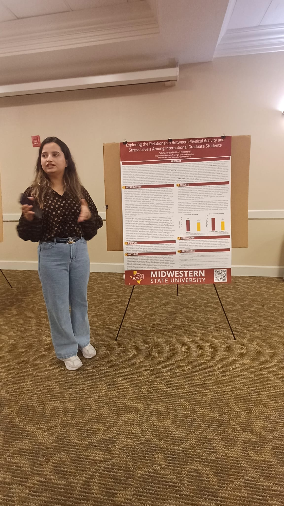
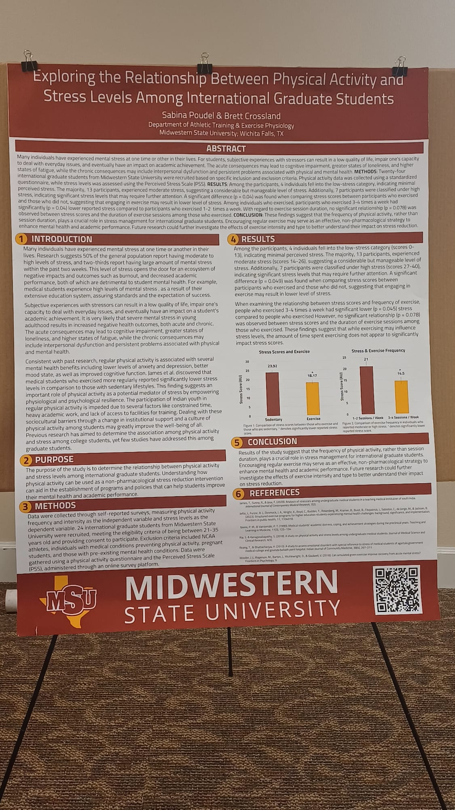
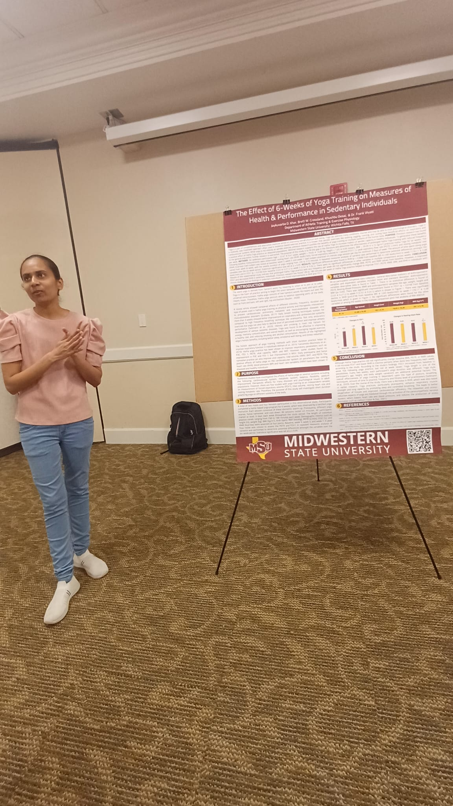
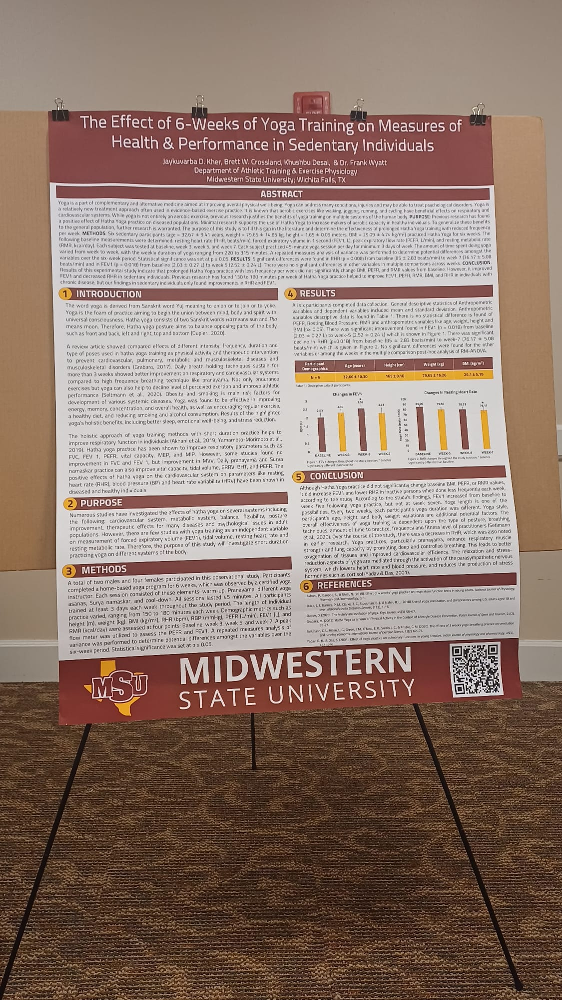
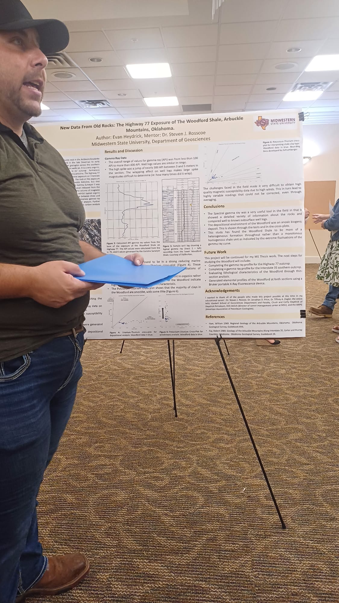
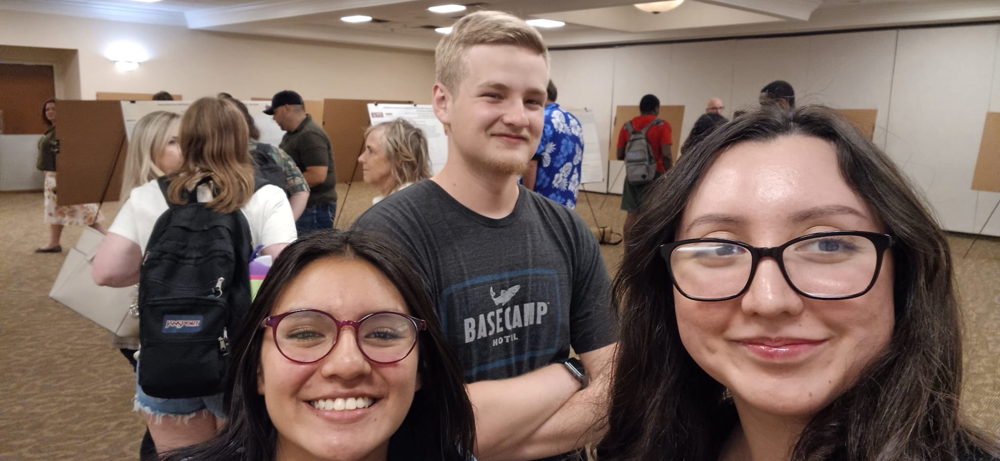

## A04 - COS (Celebration of Scholarship)
### Victoria Heredia
### Description:

This assignment's README file contains multiple photos from three presentations I attended with two friends on April 23 at the CSC Comanche Suites.

|                              PRESENTATION AND POSTER NUMBER ONE       |
| :------------------------------------------------------------------------: |
|       |
| Exploring the Relationship Between Physical Activity and Stress Levels Among International Graduate Students |

|                              PRESENTATION AND POSTER NUMBER TWO       |
| :------------------------------------------------------------------------: |
|     |
| The Effect of 6-Weeks of Yoga Training on Measures of Health & Performance in Sedentary Individuals |

|                              PRESENTATION AND POSTER NUMBER THREE      |
| :------------------------------------------------------------------------: |
|   |
| New Data From Old Rocks: The Highway 77 Exposure of The Woodford Shale, Arbuckle Mountains, Oklahoma |

|                              Rykir, Ashley and Myself   |
| :------------------------------------------------------------------------: |
|     |